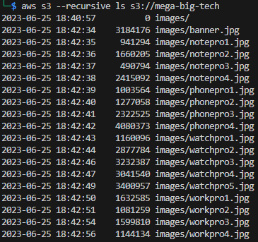

1. Scanning provided IP address with NMAP to see what's up

```
nmap -v -sV -A -oA 54.204.171.32 54.204.171.32
```

```
┌──(cylph㉿solintalis)-[~/Downloads/git/confused-binary/training/pwnedlabs/red/aws]
└─$ nmap -v -sV -A -oA 54.204.171.32 54.204.171.32
Starting Nmap 7.94SVN ( https://nmap.org ) at 2024-08-01 22:09 EDT
NSE: Loaded 156 scripts for scanning.
NSE: Script Pre-scanning.
Initiating NSE at 22:09
Completed NSE at 22:09, 0.00s elapsed
Initiating NSE at 22:09
Completed NSE at 22:09, 0.00s elapsed
Initiating NSE at 22:09
Completed NSE at 22:09, 0.00s elapsed
Initiating Ping Scan at 22:09
Scanning 54.204.171.32 [2 ports]
Completed Ping Scan at 22:09, 0.01s elapsed (1 total hosts)
Initiating Parallel DNS resolution of 1 host. at 22:09
Completed Parallel DNS resolution of 1 host. at 22:09, 0.00s elapsed
Initiating Connect Scan at 22:09
Scanning ec2-54-204-171-32.compute-1.amazonaws.com (54.204.171.32) [1000 ports]
Discovered open port 80/tcp on 54.204.171.32
Discovered open port 53/tcp on 54.204.171.32
Completed Connect Scan at 22:09, 4.81s elapsed (1000 total ports)
Initiating Service scan at 22:09
Scanning 2 services on ec2-54-204-171-32.compute-1.amazonaws.com (54.204.171.32)
Completed Service scan at 22:09, 6.03s elapsed (2 services on 1 host)
NSE: Script scanning 54.204.171.32.
Initiating NSE at 22:09
Completed NSE at 22:10, 8.26s elapsed
Initiating NSE at 22:10
Completed NSE at 22:10, 0.03s elapsed
Initiating NSE at 22:10
Completed NSE at 22:10, 0.00s elapsed
Nmap scan report for ec2-54-204-171-32.compute-1.amazonaws.com (54.204.171.32)
Host is up (0.0072s latency).
Not shown: 998 filtered tcp ports (no-response)
PORT   STATE SERVICE VERSION
53/tcp open  domain  dnsmasq 2.86
| dns-nsid: 
|_  bind.version: dnsmasq-2.86
80/tcp open  http    Apache httpd 2.4.52 ((Ubuntu))
|_http-title: Mega Big Tech
| http-methods: 
|_  Supported Methods: OPTIONS HEAD GET POST
|_http-server-header: Apache/2.4.52 (Ubuntu)
```

Find a fancy webpage. There are links at the top but they don't go anywhere. Such is lab life.


First things first, CTRL+U to view page source. Looking through the HTML and can see URLs to the S3 buckets "mega-big-tech", which is a pretty clear path based on the title of this lab.


Visting the first one we see a pic of parallel universe Chris Evans drinking some java. Neat. So they're just using the S3 bucket for static file hosting of the website's images.


Simple Storage Service, or S3, is a file service managed by AWS that allows users to store files as objects in buckets. Users can even specify their own bucket name. However, since S3 is a globally shared service, each bucket's name has to be _globally_ unique. This includes all bucket names for other AWS accounts and operational regions. Buckets now have more region visibility, but the name still have to be globally unique. Because of this we know that the name of this bucket will map back to one (1) AWS account that our target is likely to be using.

Why do we care about the AWS account ID that owns this bucket? Once we know that we can attempt more attacks that are account-specific. This is possible becuase pretty much all resources in an AWS acount are setup with an Amazon Resource Name, or ARN, to all unique lookup for the resources. Resouce policies can potentially be used to brute force the ARN for resources in other accounts. And if some of these resources are are misconfigured then it may allow a way to pivot  into the account.

Back to the lab... So here we have a S3 bucket name and want to figure out the account ID. With knowledge of the bucket name we can do some initial checks to see if the bucket policy allows other actions. So can we read the contents of the directory for the parallel universe Chris Evans picture we saw?

```
curl -s https://mega-big-tech.s3.amazonaws.com/images | xq
```


Boo. That's denied. But trying one directory higher and the root of the bucket is allowed!

```
curl -s https://mega-big-tech.s3.amazonaws.com/ | xq
```


So are there any odd keys/objects. I work with JSON a looot more than XML, so I'm going to use yq to change the XML returned by S3 directory listing to something more of my flavor. Sadly, it looks like just images are hosted in this bucket.

```
curl -s https://mega-big-tech.s3.amazonaws.com/ | yq -p=xml -o=json | jq -r '.ListBucketResult.Contents[].Key'
```

An important note with S3 static file hosting is that permissions for it are different than permissions for other AWS principals. So even if the files are able to be publicly read through static file hosting, it's always still good to try AWS-authenticated access from a different AWS account since it may allow additional and/or easier actions.

```
aws s3 ls s3://mega-big-tech
```


The bucket is similarly accessible to be read from another AWS account, so with that we can more easily get a full file listing with the `--recursive` flag. Listing all files here _could_ be helpfuly as well since a key prefix (directory/path/to/files/) or individual objects/keys (files) in a bucket can have their own policy. So some may be available as static file hosting while others aren't but may be available to AWS principals if configured with a broad policy.

```
aws s3 --recursive ls s3://mega-big-tech
```



Sadly, in this case it's still just all pictures. But there are other aws cli options we can attempt, such as uploading a file, but it doesn't work here.

```
echo "c-b testing" > test.html
aws s3 cp test.html s3://mega-big-tech/
```


Or we can try to read the bucket's ACL, as it may reveal other attack paths. It's the same outcome here though

```
aws s3api get-bucket-acl --bucket mega-big-tech
```


So where do we go from here when we still want to get more account details? An AWS account ID is a 12 character numberic value, so we _could_ try to brute force that but it would take far longer than any reasonable pen-test or bug bounty effort. Turning to search engines can help for this. These days, if there is a well known enough tool or attack method then it's been recorded in github at some point. So a search focusing here may provide useful as an initial sanity check. With this attempt, most of the initial results aren't that helpful but 4th one sounds promising.

```
site:github.com account id bucket name
```


Reading throught he details, it sounds pretty straight forward. We'll need either `s3:GetObject` or `s3:ListBucket` permissions in order to brute-force the account ID for the bucket. Thankfully with the bucket being publicly accessible we can obtain these permissions from any other AWS principal, such as one in an account we own. The lab provides credentials for this part of the lab.

It looks like the repo's link to the comapny blog post is outdated, so you can find it [here](https://cloudar.be/awsblog/finding-the-account-id-of-any-public-s3-bucket/).

But after reading through everything in the README.md and reviewing the code, we're able to do `pip install s3-account-search` for a quick install. Using the provided AWS credentials as the default profile, we can run with the ARN of th erole to assume and the bucket name.

```
s3-account-search arn:aws:iam::427648302155:role/LeakyBucket mega-big-tech
```


With that we have the account ID that the S3 bucket exists in! But we still need the flag in order to complete this task. There are a fair number of attack methods to check for publicly configured resources that may or may not provide a pivot point into the account or possibly other resources. The guide mentioned looking at EBS snapshots though, so we'll do that first for the flag. 

We can look for public EBS snapshots associated with a specific account by including the `--owner-ids` argument to `ec2 describe-snapshots` AWS cli command. 

```
aws ec2 describe-snapshots --owner-ids 107513503799
```


With the previous aws cli command to find the EBS snapshot, I happened to have the correct region configured, so lucky me, I suppose. heh But otherwise, as previously mentioned, a bunch of additional attack paths open up now that the AWS account ID is a known value. But, like the walkthrough states, knowing the operational region is also great to have in your pocket as well. This is because the ARN for a resource will typically also include the operational region in a dedicated position in the ARN string value. 

We can also just ask the AWS cli for the region and it may be kind enough to tell us.

```
aws s3api head-bucket --bucket mega-big-tech
```


Checking the headers of the request to see if they include anything regarding the operational region. The format we saw before _https://mega-big-tech.s3.amazonaws.com/_ is the legacy format and kind of a thing from when S3 was mainly a global service and not this global-but-also-regional thing it's become over time. The newer formats for this include the region name in the URL, so can loop through all the regions and request the bucket listing until we get the result with the appropriate response. There are technically two formats and it's a bit brute-forcey, but it works. I don't think either format works better than the other but I include both in my script during assessments just in case. 

See [here](https://docs.aws.amazon.com/AmazonS3/latest/userguide/VirtualHosting.html) for more and check S3 URLS with CNAMEs for some cool possible expansions to find buckets behind those DNS records.

Path-Style:         https://s3.region-code.amazonaws.com/bucket-name/key-name  
Virtual-Host-Style: https://bucket-name.s3.region-code.amazonaws.com/key-name

```
# This is by no means _all_ regions, but an okay first pass for default ones
aws ec2 describe-regions | jq -r '.Regions[].RegionName' | while read region; do 
    echo "## ${region}"; curl -s https://s3.${region}.amazonaws.com/mega-big-tech/ | yq -p=xml -o=json | jq -r '. | select(.ListBucketResult)' | head
done
```

