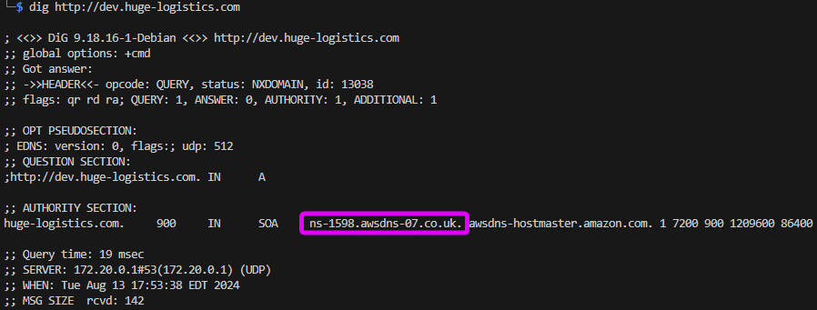

# Doing Things

We're provided with the URL "http://dev.huge-logistics.com" to visit for this one. 


Let's see what DNS says.... So we can at least see that it's hosted on AWS and likely in a UK or European region based on the returned name server address. That's something we may be useful later.



Checking the source of the page we can see that the site is using static file host. S3 static file hosting requires that the bucket name match the URL of the site bieng hosted<sup>1</sup>, so with this we can tell that the account must have an S3 bucket named "dev.huge-logistics.com". Or at least that's how it used to be. You can setup with CloudFront hosting now to not have to expose your S3 bucket name, but the URL include "https://s3.amazonaws.com/" confirms that this isn't the case and even if it was, this is one of the AWS URLs for S3 static file hosting anyways.


The hosted files referenced in the main site all seem pretty normal things by visual inspection. But just to be sure we can do some quick bash and use gitleaks to check. I threw together some questionable BASH to do it for this case and it seems okay enough for a first pass.

```
curl -s http://dev.huge-logistics.com | grep dev.huge-logistics.com | sed 's|^.*"https|https|g;s|".*||g' | while read url; do \
    direct=$(dirname $url | sed 's|https://s3.amazonaws.com/||g')
    mkdir -p $direct
    wget $url -O ${direct}/$(basename $url)
done
gitleaks detect -s dev.huge-logistics.com/ --no-git -v
```


The next thing that comes to mind is to check if the static file hosting may allow reading of the entire bucket. Sadly, that doesn't seem to be the case since an error page is shown pretty quickly.


An S3 bucket policy can be setup to allow them other AWS accounts to read it's contents as well. This test requires an "authenticated" AWS account, which for this test can be any account that you've setup for testing purposes. It's a few extra steps, but worth the effort. Here I'm just using a personal account but specific accounts may want to be setup when doing an Penetration Test for a customer.

With an authetnicated AWS account setup,  one is successful. Nice. So now we can poke around the bucket to see what's "publicly" accessible.

```
aws s3 ls s3://dev.huge-logistics.com
```


We can see the "static" directory that was expected from static file hosting, but there is also a super tempting "admin" path. But we get denied when accessing with the AWS CLI. The same is true for "migration-files" it seems. boo But we can see in "shared", which has a neat looking "hl_migration_project.zip" file.


We can download the zip file and checking it's contents we find a small PowerShell script. 

```
aws s3 cp s3://dev.huge-logistics.com/shared/hl_migration_project.zip ./
unzip -l hl_migration_project.zip
unzip hl_migration_project.zip ./migrate_secrets.ps1
```


The script looks to be pretty straight forward and mainly accomplishes a specific task: read in secrets from a provided XML file and then save each secret to AWS Secrets Manager. We can see the interaction with AWS Secrets Manager on line 19 with use of the `New-SECSecret` cmdlet<sup>2</sup>. This is something to keep in mind since the principal that would run this script presumebly has permissions for the `secretsmanager:CreateSecret` they may also have permissions for the `secretsmanager:ListSecret` and `secretsmanager:GetSecretValue` actions. If they do, then we may be able to dump the secrets from AWS Secrets Manager.


The useful details for us at this point though are the AWS access keys that are stored as plain-text values at the begening of the script. This is a bad practice that people should not replicate; not just for AWS access keys but storing any sensitive data, such as passwords or API tokens, as plaintext values in scripts.


But since we have these, we can use the AWS CLI to add them to our credetnails file under a new profile.

```
aws configure --profile pwnlabs_b2
```


With the new profile added, we're able to list and get objects stored in the "admin" path. This includes the flag.txt and a transaction report file. And the flag.txt file isn't directly accessible with the key we have. whompwhomp


It feels like we probably have access to the `s3:List-Objects` action, so we can do a recurrsive list of the bucket and see files are available and their sizes.

```
aws --profile pwnlabs_b2 s3 ls --recursive --human-readable --summarize s3://dev.huge-logistics.com
```


The "Total Size" provided by `--summarize` shows the bucket is pretty small, so let's just try copying everything to our local disk. This way we can just see what is successful and what errors out and not have to worry about trying each file individually. As expected we can do `s3:ListObjects` on the "admin" path but don't have `s3:GetObject` on any of the keys (files) in it. We do have those permissions for the "migration-files" directory though, so we'll poke at those.

```
mkdir bucket_dev.huge-logistics.com
aws --profile pwnlabs_b2 s3 sync s3://dev.huge-logistics.com/ bucket_dev.huge-logistics.com/
```


Inside we'll find PDF files, presumably from AWS, explaining how to migrate secrets into Secrets Manager. Makes sense with the script we found earlier. The same script is also in there also. Checking the "test-export.xml" we can find a few new secrets, including new AWS access keys and user/password pairs for various database and web services. For this lab, even if the other endpoints were responsive, I'm not going to touch them. As far as I'm considered they're out of scope so that's a nope. We can add the AWS access key details as a new profile again and then see if we can access the "admin/flag.txt" key.

```
aws configure --profile pwnlabs_b2a
aws --profile pwnlabs_b2a s3 cp s3://dev.huge-logistics.com/admin/flag.txt ./
cat flag.txt
```


Alternatively, if you don't want to or can't download a file to disk, you can always use the `presign` argument and pass it to curl.

```
curl -k $(aws --profile pwnlabs_b2a s3 presign s3://dev.huge-logistics.com/admin/flag.txt --expires-in 60)
```


But I'm off since my cat is yowling for food again. _again_ lol have fun hacking.

p.s. Also, looks like that principal doesn't have `secretsmanager:List-Secrets` permissions. booo


## Refrences
1. [Tutorial: Configuring a static website on Amazon S3](https://docs.aws.amazon.com/AmazonS3/latest/userguide/HostingWebsiteOnS3Setup.html)
2. [New-SECSecret Cmdlet](https://docs.aws.amazon.com/powershell/latest/reference/items/New-SECSecret.html)